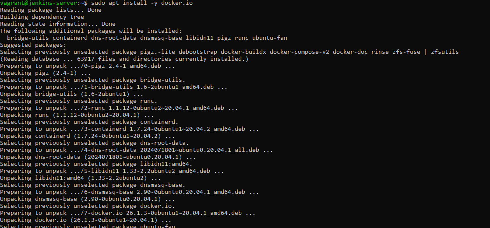
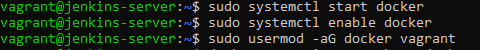
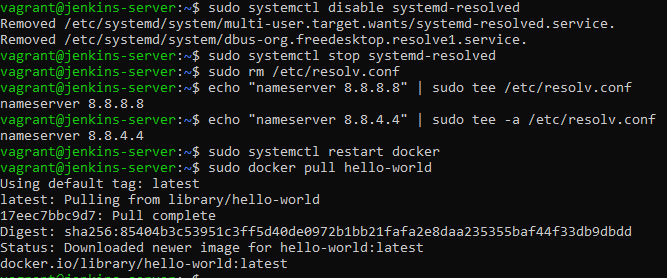
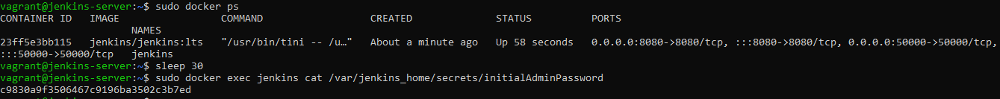
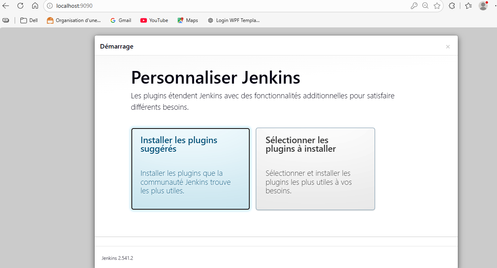
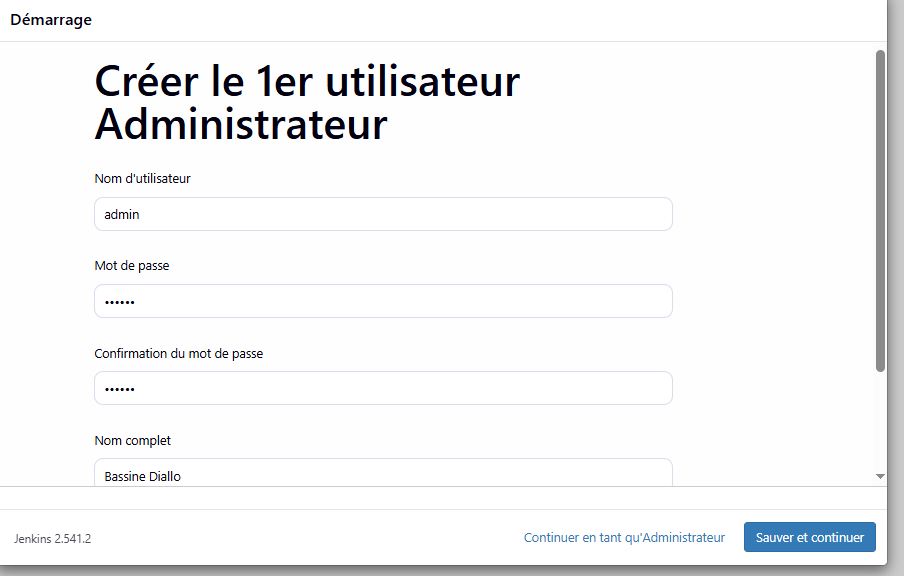
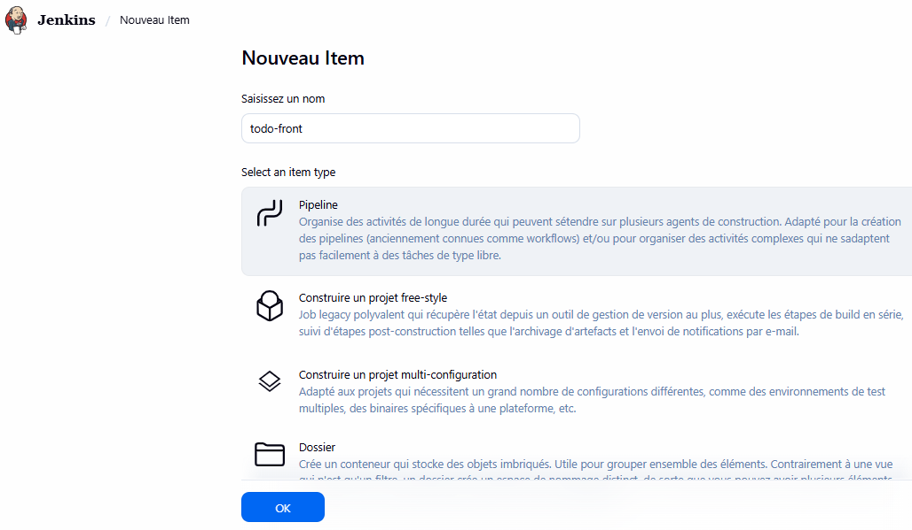
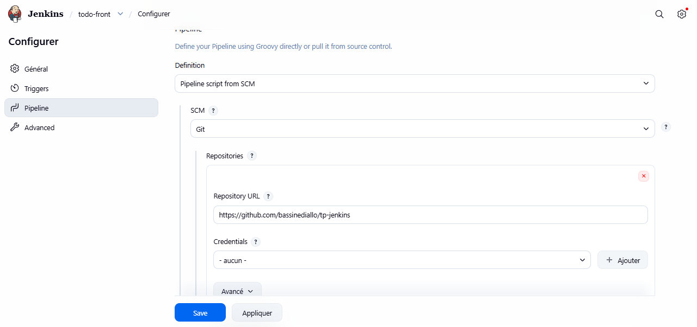
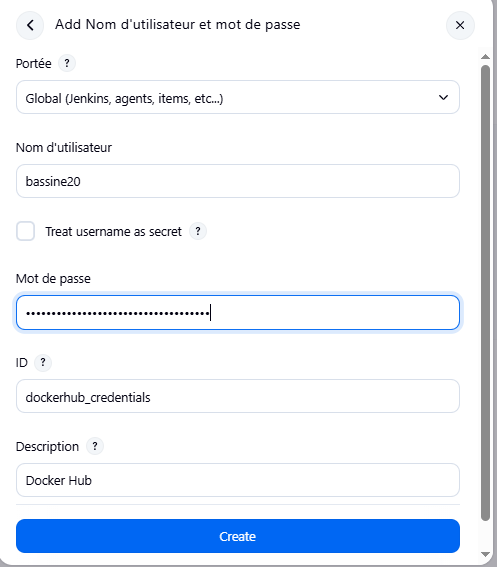
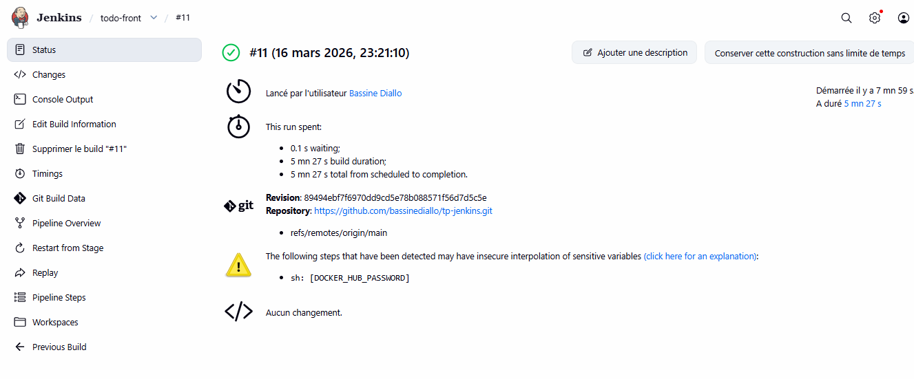

# TP Jenkins — Pipeline CI/CD avec Jenkins et Docker

## Présentation du projet

Ce projet est une application React de gestion de tâches **(Todo App)** déployée via une pipeline CI/CD complète avec **Jenkins** et **Docker**.

Jenkins est installé via Docker dans une machine virtuelle Vagrant et orchestre automatiquement le **build**, les **tests** et le **push** de l'image Docker sur Docker Hub à chaque déclenchement de la pipeline.

---

## Technologies utilisées

| Technologie | Rôle |
|---|---|
| React | Framework front-end |
| npm | Gestionnaire de paquets |
| Vagrant + VirtualBox | Machine virtuelle pour héberger Jenkins |
| Jenkins | Serveur CI/CD auto-hébergé |
| Docker | Conteneurisation de Jenkins et de l'application |
| Docker Hub | Registry pour stocker l'image Docker |
| Nginx | Serveur web pour servir l'application en production |
| GitHub | Hébergement du code source |

---

## Architecture

```
GitHub (code source)
       |
       | push → déclenche le build
       ▼
Jenkins (dans Docker, dans Vagrant)
       |
       |── Stage 1 : Clone      → récupère le code depuis GitHub
       |── Stage 2 : Build React → npm install + npm run build
       |── Stage 3 : Unit Test   → npm test
       |── Stage 4 : Push Docker → build image + push sur Docker Hub
       └── Stage 5 : Deploy      → confirmation du déploiement
       |
       ▼
Docker Hub (bassine20/todo-front:vN)
```

---

## Structure du projet

```
tp-jenkins/
├── Jenkinsfile          # Configuration de la pipeline CI/CD
├── Dockerfile           # Image Docker multi-stage (build + serve)
├── nginx.conf           # Configuration du serveur Nginx
├── public/              # Fichiers statiques publics
├── src/                 # Code source React
│   ├── App.js
│   ├── App.test.js
│   └── index.js
├── package.json         # Dépendances npm
└── README.md            # Documentation du projet
```

---

## Étapes de mise en place

### Étape 1 — Créer la VM Jenkins avec Vagrant

Créer un fichier `Vagrantfile` :

```ruby
Vagrant.configure("2") do |config|
  config.vm.box = "ubuntu/focal64"
  config.vm.hostname = "jenkins-server"
  config.vm.network "forwarded_port", guest: 8080, host: 9090
  config.vm.provider "virtualbox" do |vb|
    vb.memory = "4096"
    vb.cpus = 2
  end
end
```

```bash
vagrant up
vagrant ssh
```

---

### Étape 2 — Installer Docker dans la VM

```bash
# Fix DNS
echo "nameserver 8.8.8.8" | sudo tee /etc/resolv.conf

# Installe Docker
sudo apt update
sudo apt install -y docker.io
sudo systemctl start docker
sudo systemctl enable docker
sudo usermod -aG docker vagrant
```





---

### Étape 3 — Corriger le DNS pour Docker

```bash
# Désactive le resolver DNS local d'Ubuntu
sudo systemctl disable systemd-resolved
sudo systemctl stop systemd-resolved
sudo rm /etc/resolv.conf
echo "nameserver 8.8.8.8" | sudo tee /etc/resolv.conf
echo "nameserver 8.8.4.4" | sudo tee -a /etc/resolv.conf
sudo systemctl restart docker

# Teste que Docker peut accéder à internet
sudo docker pull hello-world
```



---

### Étape 4 — Lancer Jenkins via Docker

```bash
sudo docker run -d --name jenkins \
  -p 8080:8080 \
  -p 50000:50000 \
  -v jenkins_home:/var/jenkins_home \
  -v /var/run/docker.sock:/var/run/docker.sock \
  jenkins/jenkins:lts

# Récupère le mot de passe initial
sleep 30
sudo docker exec jenkins cat /var/jenkins_home/secrets/initialAdminPassword
```


---

### Étape 5 — Accéder à Jenkins sur http://localhost:9090

Saisir le mot de passe initial puis cliquer sur **"Installer les plugins suggérés"**.



---

### Étape 6 — Créer le compte administrateur

Remplir le formulaire avec les informations de l'administrateur.



---

### Étape 7 — Créer le pipeline Jenkins

Cliquer sur **"Nouveau Item"** → nommer le projet `todo-front` → sélectionner **"Pipeline"** → cliquer **OK**.



---

### Étape 8 — Configurer le pipeline (Pipeline script from SCM)

Dans la section **Pipeline** :
- **Definition** : `Pipeline script from SCM`
- **SCM** : `Git`
- **Repository URL** : `https://github.com/bassinediallo/tp-jenkins.git`
- **Branch** : `*/main`
- **Script Path** : `Jenkinsfile`



---

### Étape 9 — Configurer les credentials Docker Hub

Dans **Administrer Jenkins** → **Credentials** → **Global** → **Add Credentials** :

- **Kind** : `Username with password`
- **Username** : `bassine20`
- **Password** : token Docker Hub
- **ID** : `dockerhub_credentials`



---

## Pipeline CI/CD

La pipeline est définie dans le `Jenkinsfile` et se compose de 5 stages :

```
push → [Clone] → [Build React] → [Unit Test] → [Push Docker Hub] → [Deploy]
```

### Fichier Jenkinsfile

```groovy
pipeline {
    agent any

    stages {
        stage('Clone') {
            steps {
                git branch: 'main',
                    url: 'https://github.com/bassinediallo/tp-jenkins.git'
            }
        }

        stage('Build React') {
            steps {
                sh "npm install --force"
                sh "npm run build"
                sh "mkdir -p staging && cp -r build/* staging/"
            }
        }

        stage('Unit Test') {
            steps {
                sh "npm install --force"
                sh "npm test -- --watchAll=false --passWithNoTests"
            }
        }

        stage('Push to Docker Hub') {
            steps {
                withCredentials([usernamePassword(
                    credentialsId: 'dockerhub_credentials',
                    passwordVariable: 'DOCKER_HUB_PASSWORD',
                    usernameVariable: 'DOCKER_HUB_USERNAME'
                )]) {
                    sh "docker build -t ${DOCKER_HUB_USERNAME}/todo-front:v${BUILD_NUMBER} ."
                    sh "docker login -u ${DOCKER_HUB_USERNAME} -p ${DOCKER_HUB_PASSWORD}"
                    sh "docker push ${DOCKER_HUB_USERNAME}/todo-front:v${BUILD_NUMBER}"
                }
            }
        }

        stage('Deploy') {
            steps {
                withCredentials([usernamePassword(
                    credentialsId: 'dockerhub_credentials',
                    passwordVariable: 'DOCKER_HUB_PASSWORD',
                    usernameVariable: 'DOCKER_HUB_USERNAME'
                )]) {
                    echo "Image ${DOCKER_HUB_USERNAME}/todo-front:v${BUILD_NUMBER} pushee sur Docker Hub !"
                    echo "Pipeline termine avec succes !"
                }
            }
        }
    }

    post {
        success { echo "Pipeline build successfully" }
        failure { echo "Pipeline failed" }
    }
}
```

---

### Dockerfile (multi-stage)

```dockerfile
# Stage 1 : Build React
FROM node:18-alpine AS build
WORKDIR /app
COPY package*.json ./
RUN npm install --force
COPY . .
RUN npm run build

# Stage 2 : Serve avec Nginx
FROM nginx:stable-alpine
COPY --from=build /app/build /usr/share/nginx/html
COPY nginx.conf /etc/nginx/conf.d/default.conf
EXPOSE 80
CMD ["nginx", "-g", "daemon off;"]
```

---

## Résultat Final — Pipeline réussie ✅

La pipeline s'exécute avec succès en **5 minutes 27 secondes**. Tous les stages passent au vert.





---

## Lancer le projet en local

```bash
# Cloner le projet
git clone https://github.com/bassinediallo/tp-jenkins.git
cd tp-jenkins

# Installer les dépendances
npm install

# Lancer en mode développement
npm start
```

### Avec Docker

```bash
docker build -t todo-front .
docker run -p 80:80 todo-front
```

### Relancer Jenkins

```bash
# Dans la VM Vagrant
vagrant ssh
sudo docker start jenkins
# Accessible sur http://localhost:9090
```

---

## Problèmes rencontrés et solutions

| Problème | Cause | Solution |
|---|---|---|
| `docker: unauthorized` | Non connecté à Docker Hub | `docker login -u username` avec token |
| `DNS resolution failed` | DNS VirtualBox cassé | Désactiver systemd-resolved, utiliser 8.8.8.8 |
| `docker: not found` | Docker CLI absent dans Jenkins | Réinstaller Jenkins avec Docker CLI inclus |
| `permission denied /var/run/docker.sock` | Jenkins n'a pas accès au socket | `sudo chmod 666 /var/run/docker.sock` |
| `npm: not found` | Node.js absent dans Jenkins | Installer Node.js 18 dans le conteneur Jenkins |
| `EACCES permission denied` | Permissions workspace incorrectes | `chown -R jenkins:jenkins /var/jenkins_home/workspace/` |
| `git-remote-https died of signal 11` | Bug git dans Jenkins | Réinstaller git + `http.version HTTP/1.1` |

---

## Auteur

**Bassine Diallo** — M2GL DevOps  
Dépôt GitHub : [github.com/bassinediallo/tp-jenkins](https://github.com/bassinediallo/tp-jenkins)
